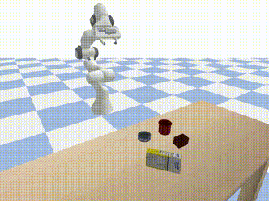
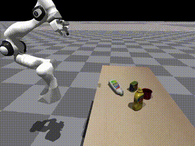
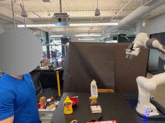
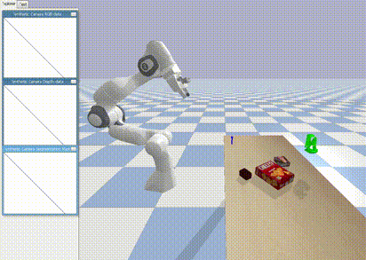
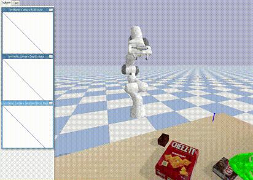
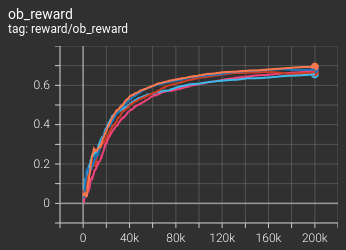
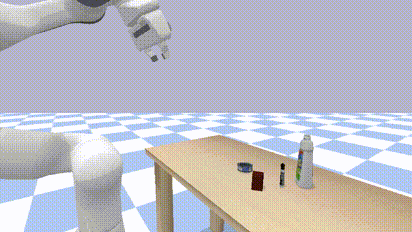
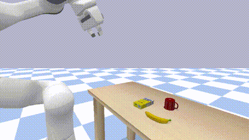

<p align="center">
    
    
    
</p>

# Handover-Sim2Real

Handover-Sim2Real is the official code for the following CVPR 2023 paper:

**Learning Human-to-Robot Handovers from Point Clouds**  
Sammy Christen, Wei Yang, Claudia Pérez-D'Arpino, Otmar Hilliges, Dieter Fox, Yu-Wei Chao  
IEEE/CVF Conference on Computer Vision and Pattern Recognition (CVPR), 2023  
[ [arXiv](https://arxiv.org/abs/2303.17592) ] [ [video](https://youtu.be/IsjCdoIAA7s) ] [ [project site](https://handover-sim2real.github.io) ]

### Citing Handover-Sim2Real

```BibTeX
@INPROCEEDINGS{christen:cvpr2023,
  author    = {Sammy Christen and Wei Yang and Claudia P\'{e}rez-D'Arpino and Otmar Hilliges and Dieter Fox and Yu-Wei Chao},
  booktitle = {IEEE/CVF Conference on Computer Vision and Pattern Recognition (CVPR)},
  title     = {Learning Human-to-Robot Handovers from Point Clouds},
  year      = {2023},
}
```

### License

Handover-Sim2Real is released under the [NVIDIA License](LICENSE).

### Acknowledgements

This repo is based on a Python project template created by [Rowland O'Flaherty](https://github.com/rowoflo).

### Contents

1. [Prerequisites](#prerequisites)
2. [Installation](#installation)
3. [Quick Demo with Pre-trained Model](#quick-demo-with-pre-trained-model)
4. [Training](#training)
    1. [Reproducibility and Ray](#reproducibility-and-ray)
5. [Testing](#testing)
6. [Evaluation](#evaluation)
7. [Reproducing CVPR 2023 Results](#reproducing-cvpr-2023-results)
8. [Rendering from Result and Saving Rendering](#rendering-from-result-and-saving-rendering)

## Prerequisites

This code is tested with Python 3.8 on Ubuntu 20.04.

## Installation

For good practice for Python package management, it is recommended to install the package into a virtual environment (e.g., `virtualenv` or `conda`).

First, clone the repo with `--recursive` and cd into it:

```Shell
git clone --recursive https://github.com/NVlabs/handover-sim2real.git
cd handover-sim2real
```

Installation consists of four modules:

1. `handover-sim2real` (main repo)
2. `handover-sim` (submodule)
3. `GA-DDPG` (submodule)
4. `OMG-Planner` (submodule): Can be skipped if you are not running [Training](#training).

Below are the step-by-step installation commands:

1. `handover-sim2real` (main repo)

    ```Shell
    # Install handover-sim2real as Python pacakge.
    pip install -e .
    ```

2. `handover-sim` (submodule)

    Before running the commands below, download MANO models and code (`mano_v1_2.zip`) from the [MANO website](https://mano.is.tue.mpg.de) and place the file under `handover-sim/handover/data/`.

    ```Shell
    cd handover-sim

    # Install handover-sim and submodule mano_pybullet as Python package.
    pip install --no-deps -e .
    pip install --no-deps -e ./mano_pybullet

    cd handover/data

    # Unzip mano_v1_2.zip.
    unzip mano_v1_2.zip

    # Download DexYCB dataset.
    gdown 1Jqe2iqI7inoEdE3BL4vEs25eT5M7aUHd
    tar zxvf dex-ycb-cache-20220323.tar.gz

    # Compile assets.
    gdown 1tDiXvW5vwJDOCgK61VEsFaZ7Z00gF0vj
    tar zxvf assets-3rd-party-20220511.tar.gz
    cd ../..
    ./handover/data/compile_assets.sh

    cd ..
    ```

    For more details, see the [handover-sim](https://github.com/NVlabs/handover-sim) repo.

3. `GA-DDPG` (submodule)

    ```Shell
    cd GA-DDPG

    # Install Pointnet2_PyTorch as Python package.
    git clone https://github.com/liruiw/Pointnet2_PyTorch
    cd Pointnet2_PyTorch
    git checkout dabe33a
    pip install --no-deps -e ./pointnet2_ops_lib
    cd ..

    # Download data.
    gdown 136rLjyjFFRMyVxUZT6txB5XR2Ct_LNWC
    unzip shared_data.zip -d data

    cd ..
    ```

    For more details, see the [GA-DDPG](https://github.com/liruiw/GA-DDPG) repo.

4. `OMG-Planner` (submodule): Can be skipped if you are not running [Training](#training).

    ```Shell
    # Install Ubuntu packages.
    # - libassimp-dev is required for pyassimp.
    # - libegl-dev is required for ycb_renderer.
    # - libgles2 is required for ycb_renderer.
    # - libglib2.0-0 is required for opencv-python.
    # - libxslt1-dev is required for lxml.
    apt install \
        libassimp-dev \
        libegl-dev \
        libgles2 \
        libglib2.0-0 \
        libxslt1-dev

    cd OMG-Planner

    # Install ycb_render.
    cd ycb_render
    python setup.py develop
    cd ..

    # Install eigen.
    git clone https://gitlab.com/libeigen/eigen.git
    cd eigen
    git checkout 3.4.0
    mkdir -p release && mkdir -p build && cd build
    cmake .. \
      -DCMAKE_INSTALL_PREFIX=$( cd ../release && pwd )
    make -j8
    make install
    cd ../..

    # Install Sophus.
    cd Sophus
    mkdir -p release && mkdir -p build && cd build
    cmake .. \
      -DCMAKE_INSTALL_PREFIX=$( cd ../release && pwd ) \
      -DEIGEN3_INCLUDE_DIR=$( cd ../../eigen/release/include/eigen3 && pwd )
    make -j8
    make install
    cd ../..

    # Install layers.
    cd layers
    sed -i "s@/usr/local/include/eigen3\", \"/usr/local/include@$( cd ../eigen/release/include/eigen3 && pwd )\", \"$( cd ../Sophus/release/include && pwd )@g" setup.py
    python setup.py install
    cd ..

    # Install PyKDL.
    cd orocos_kinematics_dynamics
    cd sip-4.19.3
    python configure.py
    make -j8
    make install
    cd ../orocos_kdl
    mkdir -p release && mkdir -p build && cd build
    cmake .. \
      -DCMAKE_INSTALL_PREFIX=$( cd ../release && pwd ) \
      -DEIGEN3_INCLUDE_DIR=$( cd ../../../eigen/release/include/eigen3 && pwd )
    make -j8
    make install
    cd ../../python_orocos_kdl
    mkdir -p build && cd build
    # ** IF YOU USE VIRTUALENV: USE $VIRTUAL_ENV BELOW **
    # ** IF YOU USE CONDA: REMOVE the -DPYTHON_EXECUTABLE FLAG **
    # ** IF YOU USE NEITHER VIRTUALENV NOR CONDA: YOU MAY NEED TO EDIT -DPYTHON_EXECUTABLE **
    cmake .. \
      -DPYTHON_EXECUTABLE=$VIRTUAL_ENV/bin/python \
      -DCMAKE_PREFIX_PATH=$( cd ../../orocos_kdl/release && pwd )
    make -j8
    # ** IF YOU USE CONDA: REPLACE $VIRTUAL_ENV WITH $CONDA_PREFIX **
    cp PyKDL.so $VIRTUAL_ENV/lib/python3.8/site-packages
    cd ../../..

    # Download data.
    gdown 1tHPAQ2aPdkp8cwtFP4gs4wdcP02jfGpH
    unzip data.zip

    cd ..
    ```

    For more details, see the [OMG-Planner](https://github.com/liruiw/OMG-Planner) repo.

## Quick Demo with Pre-trained Model

Download the CVPR 2023 pre-trained models and grasp predictor:

```Shell
# Download CVPR 2023 models.
./output/fetch_cvpr2023_models.sh

# Download grasp predictor.
./output/fetch_grasp_trigger_PRE_2.sh
```

Run:

```Shell
GADDPG_DIR=GA-DDPG CUDA_VISIBLE_DEVICES=0 python examples/test.py \
  --model-dir output/cvpr2023_models/2022-10-16_08-48-30_finetune_5_s0_train \
  --without-hold \
  SIM.RENDER True \
  SIM.INIT_VIEWER_CAMERA_POSITION "(+1.6947, -0.1000, +1.6739)" \
  SIM.INIT_VIEWER_CAMERA_TARGET "(+0.0200, -0.1000, +0.9100)"
```

This will:

1. Open a visualizer window.
2. Go through each scene in the `test` split of `s0` (see [handover-sim](https://github.com/NVlabs/handover-sim) for more details).
3. Execute the actions generated from the **without hold** (aka **simultaneous**) policy using the pre-trained model `output/cvpr2023_models/2022-10-16_08-48-30_finetune_5_s0_train`.

<p align="center">
    
    
</p>

## Training

We follow the protocol of the [handover-sim](https://github.com/NVlabs/handover-sim) benchmark for training and testing. Below we show how to train a model on the `train` split of the `s0` setup.

The training process comprises two stages:

1. **pretraining**.
2. **finetuning**.

See the [CVPR 2023 paper](https://arxiv.org/pdf/2303.17592.pdf) for more details.

- First, download the grasp predictor if you have not:

    ```Shell
    # Download grasp predictor.
    ./output/fetch_grasp_trigger_PRE_2.sh
    ```

- For the **pretraining** stage, run:

    ```Shell
    GADDPG_DIR=GA-DDPG OMG_PLANNER_DIR=OMG-Planner CUDA_VISIBLE_DEVICES=0 python examples/train.py \
      --cfg-file examples/pretrain.yaml \
      --seed 1 \
      --use-ray
    ```

    This will:

    1. Start the training from scratch with random seed `1`.
    2. Use [Ray](https://github.com/ray-project/ray) to spawn mutiple worker processes (`3` by default) for collecting training experiences.
    3. Save training output and checkpoints to a new folder `output/*_pretrain_1_s0_train/`.

    The training statistics are logged in the TensorBoard format. You can launch TensorBoard with:

    ```Shell
    tensorboard --logdir output
    ```

    

    Depending on your compute configuration, the **pretraining** job may take from sub-day to days to complete.

- Once the **pretraining** job completes, you can proceed to the **finetuning** stage. Or if you have downloaded the CVPR 2023 pre-trained models, you can also start from the pretraining models there and skip running the pretraining stage yourself.

    To run **finetuning**, you need to give an output folder from **pretraining**. For example, if your **pretraining** output folder is `output/2022-09-30_11-54-42_pretrain_1_s0_train/`, run:

    ```Shell
    GADDPG_DIR=GA-DDPG OMG_PLANNER_DIR=OMG-Planner CUDA_VISIBLE_DEVICES=0 python examples/train.py \
      --cfg-file examples/finetune.yaml \
      --seed 1 \
      --use-ray \
      --use-grasp-predictor \
      --pretrained-dir output/2022-09-30_11-54-42_pretrain_1_s0_train
    ```

    This will:

    1. Start the training from the latest **pretraining** checkpoint with random seed `1`.
    2. Like in **pretraining**, use [Ray](https://github.com/ray-project/ray) to spawn mutiple worker processes (`3` by default) for collecting training experiences.
    3. Additionally use the grasp predictor to predict whether to execute grasping.
    4. Save training output and checkpoints to a new folder `output/*_finetune_1_s0_train/`.

    Likewise, the training statistics are logged in the TensorBoard format. You can launch TensorBoard with the same command:

    ```Shell
    tensorboard --logdir output
    ```

    

    Likewise, depending on your compute configuration, the **finetuning** job may take from sub-day to days to complete.

- As described in the [CVPR 2023 paper](https://arxiv.org/pdf/2303.17592.pdf), the results we report are averaged over 3 training runs (**pretraining** + **finetuning**) with different random seeds. You can change the random seed by changing the argument of `--seed` in the commands above, e.g., from `1` to `2`, `3`, `4`, `5`, etc.

### Reproducibility and Ray

As described above, we use [**Ray**](https://github.com/ray-project/ray) to **speed up training** by spawning multiple worker processes. However, this also makes data collection asynchronous and therefore the training process **non-deterministic**.

For development and debugging purposes, it may be beneficial to enforce **reproducibility**. Therefore, we also provide a way to run training **with Ray disabled**. However, the job will also take longer to complete, since we can only use one process to run data collection together with other training routines.

To **disable Ray**, you just need to remove the `--use-ray` flag.

- For the **pretraining** stage, run:

    ```Shell
    GADDPG_DIR=GA-DDPG OMG_PLANNER_DIR=OMG-Planner CUDA_VISIBLE_DEVICES=0 python examples/train.py \
      --cfg-file examples/pretrain.yaml \
      --seed 1
    ```

- For the **finetuning** stage, if your **pretraining** output folder is `output/2022-09-30_11-54-42_pretrain_1_s0_train/`, run:

    ```Shell
    GADDPG_DIR=GA-DDPG OMG_PLANNER_DIR=OMG-Planner CUDA_VISIBLE_DEVICES=0 python examples/train.py \
      --cfg-file examples/finetune.yaml \
      --seed 1 \
      --use-grasp-predictor \
      --pretrained-dir output/2022-09-30_11-54-42_pretrain_1_s0_train
    ```

## Testing

Again, we follow the protocol of the [handover-sim](https://github.com/NVlabs/handover-sim) benchmark for training and testing. Below we show how to test a trained model on the `test` split of the `s0` setup.

We test with two settings for the policy:

1. **hold** (aka **sequential**, same as the setting in the **pretraining** stage).
2. **without-hold** (aka **simultaneous**, same as the setting in the **finetuning** stage).

See the [CVPR 2023 paper Sec. 5.1 "Simulation Evaluation"](https://arxiv.org/pdf/2303.17592.pdf) for more details.

We first provide an example by testing on the CVPR 2023 pre-trained models

- First, download the CVPR 2023 pre-trained models and grasp predictor if you have not:

    ```Shell
    # Download CVPR 2023 models.
    ./output/fetch_cvpr2023_models.sh

    # Download grasp predictor.
    ./output/fetch_grasp_trigger_PRE_2.sh
    ```

- For example, to test the model in `output/cvpr2023_models/2022-10-16_08-48-30_finetune_5_s0_train/`, run:

    ```Shell
    GADDPG_DIR=GA-DDPG CUDA_VISIBLE_DEVICES=0 python examples/test.py \
      --model-dir output/cvpr2023_models/2022-10-16_08-48-30_finetune_5_s0_train \
      SIM.RENDER True
    ```

    This will:

    1. Open a visualizer window.
    2. Go through each scene in the `test` split of `s0`.
    3. Execute the actions generated from the **hold** (aka **sequential**) policy using the model in `output/cvpr2023_models/2022-10-16_08-48-30_finetune_5_s0_train/`.

    To switch from the **hold** (aka **sequential**) policy to the **without-hold** (aka **simultaneous**) policy, just add a `--without-hold` flag:

    ```Shell
    GADDPG_DIR=GA-DDPG CUDA_VISIBLE_DEVICES=0 python examples/test.py \
      --model-dir output/cvpr2023_models/2022-10-16_08-48-30_finetune_5_s0_train \
      --without-hold \
      SIM.RENDER True
    ```

    This is exactly what we ran in the quick demo above.

- The two commands above are mostly just for visualization purposes, and thus do not save the benchmark result. To **save the result** for evaluation later, set `BENCHMARK.SAVE_RESULT` to `True`, and remove `SIM.RENDER` to run headless if you don't need the visualizer window. Also you can optionally add a `--name` argument to for the name of the folder where the results will be saved.

    For example, to test the model in `output/cvpr2023_models/2022-10-16_08-48-30_finetune_5_s0_train/` with the **hold** (aka **sequential**) policy, run:

    ```Shell
    GADDPG_DIR=GA-DDPG CUDA_VISIBLE_DEVICES=0 python examples/test.py \
      --model-dir output/cvpr2023_models/2022-10-16_08-48-30_finetune_5_s0_train \
      --name finetune_5 \
      BENCHMARK.SAVE_RESULT True
    ```

    The result will be saved to a new folder `results/*_handover-sim2real-hold_finetune_5_s0_test/`.

    Similary, to test the model in `output/cvpr2023_models/2022-10-16_08-48-30_finetune_5_s0_train/` with the **without-hold** (aka **simultaneous**) policy, run:

    ```Shell
    GADDPG_DIR=GA-DDPG CUDA_VISIBLE_DEVICES=0 python examples/test.py \
      --model-dir output/cvpr2023_models/2022-10-16_08-48-30_finetune_5_s0_train \
      --without-hold \
      --name finetune_5 \
      BENCHMARK.SAVE_RESULT True
    ```

    The result will be saved to a new folder `results/*_handover-sim2real-wo-hold_finetune_5_s0_test/`.

- Once the job finishes, you are ready to run evaluation and see the result. See the [Evaluation](#evaluation) section.

- The full set of testing commands we used in the [CVPR 2023 paper](https://arxiv.org/pdf/2303.17592.pdf) with the pre-trained models can be found in `examples/all_cvpr2023_models_test.sh`

Beside testing on the pre-trained models, you can also test your own trained model from the [Training](#training) section. All you need is to set the `--model-dir` argument.

- For example, to test the trained model in `output/2023-10-19_00-00-00_finetune_1_s0_train/`, for **hold** (aka **sequential**), run:

    ```Shell
    GADDPG_DIR=GA-DDPG CUDA_VISIBLE_DEVICES=0 python examples/test.py \
      --model-dir output/2023-10-19_00-00-00_finetune_1_s0_train \
      --name finetune_1 \
      BENCHMARK.SAVE_RESULT True
    ```

    and for **without-hold** (aka **simultaneous**), run:

    ```Shell
    GADDPG_DIR=GA-DDPG CUDA_VISIBLE_DEVICES=0 python examples/test.py \
      --model-dir output/2023-10-19_00-00-00_finetune_1_s0_train \
      --without-hold \
      --name finetune_1 \
      BENCHMARK.SAVE_RESULT True
    ```

- Again, once the job finishes, you are ready to run evaluation and see the result. See the [Evaluation](#evaluation) section.

## Evaluation

We use the same code from [handover-sim](https://github.com/NVlabs/handover-sim) for evaluation. Also see their [Evaluation](https://github.com/NVlabs/handover-sim/tree/master#evaluation) section.

To evaluate the result of a testing run, all you need is the **result folder** generated from running the benchmark. For example, if your result folder is `results/2022-11-09_17-55-43_handover-sim2real-wo-hold_finetune_5_s0_test/`, run the following command:

```Shell
python handover-sim/examples/evaluate_benchmark.py \
  --res_dir results/2022-11-09_17-55-43_handover-sim2real-wo-hold_finetune_5_s0_test
```

You should see an output similar to the following in the terminal:

    ```
    2023-04-14 07:09:09: Running evaluation for results/2022-11-09_17-55-43_handover-sim2real-wo-hold_finetune_5_s0_test
    2023-04-14 07:09:09: Evaluation results:
    |  success rate   |    mean accum time (s)    |                    failure (%)                     |
    |      (%)        |  exec  |  plan  |  total  |  hand contact   |   object drop   |    timeout     |
    |:---------------:|:------:|:------:|:-------:|:---------------:|:---------------:|:--------------:|
    | 68.06 ( 98/144) | 6.206  | 0.175  |  6.380  | 10.42 ( 15/144) | 15.97 ( 23/144) | 5.56 (  8/144) |
    2023-04-14 07:09:09: Printing scene ids
    2023-04-14 07:09:09: Success (98 scenes):
    ---  ---  ---  ---  ---  ---  ---  ---  ---  ---  ---  ---  ---  ---  ---  ---  ---  ---  ---  ---
      0    1    3    4    5    6    7    8    9   10   12   14   15   16   18   19   20   21   22   23
     26   29   30   31   34   37   38   39   41   43   44   46   47   48   49   51   53   54   56   57
     59   60   62   64   66   67   68   69   70   71   72   73   74   75   76   78   80   81   82   86
     89   90   92   93   96   97  100  101  103  105  108  109  110  111  113  114  116  118  120  121
    122  123  125  126  127  128  129  130  131  132  133  134  137  139  140  141  142  143
    ---  ---  ---  ---  ---  ---  ---  ---  ---  ---  ---  ---  ---  ---  ---  ---  ---  ---  ---  ---
    2023-04-14 07:09:09: Failure - hand contact (15 scenes):
    ---  ---  ---  ---  ---  ---  ---  ---  ---  ---  ---  ---  ---  ---  ---
      2   11   40   42   58   61   65   77   79   91   94   98  102  112  119
    ---  ---  ---  ---  ---  ---  ---  ---  ---  ---  ---  ---  ---  ---  ---
    2023-04-14 07:09:09: Failure - object drop (23 scenes):
    ---  ---  ---  ---  ---  ---  ---  ---  ---  ---  ---  ---  ---  ---  ---  ---  ---  ---  ---  ---
     13   17   25   27   28   35   36   45   52   55   63   83   84   85   88   95  106  107  115  117
    135  136  138
    ---  ---  ---  ---  ---  ---  ---  ---  ---  ---  ---  ---  ---  ---  ---  ---  ---  ---  ---  ---
    2023-04-14 07:09:09: Failure - timeout (8 scenes):
    ---  ---  ---  ---  ---  ---  ---  ---
     24   32   33   50   87   99  104  124
    ---  ---  ---  ---  ---  ---  ---  ---
    2023-04-14 07:09:09: Evaluation complete.
    ```

The same output will also be logged to `results/2022-11-09_17-55-43_handover-sim2real-wo-hold_finetune_5_s0_test/evaluate.log`.

## Reproducing CVPR 2023 Results

We provide the result folders of the benchmarks reported in the [CVPR 2023 paper](https://arxiv.org/pdf/2303.17592.pdf). You can run evaluation on these files and reproduce the exact numbers in the paper.

To run the evaluation, you need to first download the CVPR 2023 results.

```Shell
# Download CVPR 2023 results.
./results/fetch_cvpr2023_results.sh
```

This will extract a folder `results/cvpr2023_results/` containing the result folders.

You can now run evaluation on these result folders. For example, for **Ours** + **simultaneous** (aka **without-hold**) on `s0` (see [CVPR 2023 paper Tab. 1 and 2](https://arxiv.org/pdf/2303.17592.pdf)), run:

```Shell
# Seed 1
python handover-sim/examples/evaluate_benchmark.py \
  --res_dir results/cvpr2023_results/2022-11-09_16-02-29_handover-sim2real-wo-hold_finetune_1_s0_test
# Seed 4
python handover-sim/examples/evaluate_benchmark.py \
  --res_dir results/cvpr2023_results/2022-11-09_17-27-28_handover-sim2real-wo-hold_finetune_4_s0_test
# Seed 5
python handover-sim/examples/evaluate_benchmark.py \
  --res_dir results/cvpr2023_results/2022-11-09_17-55-43_handover-sim2real-wo-hold_finetune_5_s0_test
```

If you averge the numbers over these three evaluation runs, you should be able to reproduce the corresponding numbers in the paper.

Also for `2022-11-09_17-55-43_handover-sim2real-wo-hold_finetune_5_s0_test`, you should see the exact same result shown in the example of the [Evaluation](#evaluation) section.

The full set of evaluation commands can be found in `examples/all_cvpr2023_results_eval.sh`.

## Rendering from Result and Saving Rendering

We use the same code from [handover-sim](https://github.com/NVlabs/handover-sim) for rendering from result and saving rendering. Also see their [Rendering from Result and Saving Rendering](https://github.com/NVlabs/handover-sim/tree/master#rendering-from-result-and-saving-rendering) section.

- While you can run testing with a visualizer window by adding `SIM.RENDER True` (e.g., see the [Testing](#testing) section), you can also run headless and **re-render the rollouts** with a **visualizer window** after the fact&mdash;as long as you saved the result with `BENCHMARK.SAVE_RESULT True`.

    For example, if your result folder is `results/2022-11-09_17-55-43_handover-sim2real-wo-hold_finetune_5_s0_test/`, run the following command:

    ```Shell
    python handover-sim/examples/render_benchmark.py \
      --res_dir results/2022-11-09_17-55-43_handover-sim2real-wo-hold_finetune_5_s0_test \
      SIM.RENDER True
    ```

    This will run the same benchmark environment with a policy that simply loads and executes the actions from the saved result.

    Consequently, if you have downloaded the CVPR 2023 results following the [Reproducing CVPR 2023 Results](#reproducing-cvpr-2023-results) Section, you can also try rendering from one of the downloaded result folders, for example:

    ```Shell
    python handover-sim/examples/render_benchmark.py \
      --res_dir results/cvpr2023_results/2022-11-09_17-55-43_handover-sim2real-wo-hold_finetune_5_s0_test \
      SIM.RENDER True
    ```

    This allows you to visualize the rollouts in the CVPR 2023 results.

- Apart from the visualizer window, you can also **re-render the rollouts** with an **offscreen renderer** and further **save the rendered frame** into `.jpg` files. These `.jpg` files can later further be converted into `.mp4` video files for offline visualization.

    For example, if your result folder is `results/2022-11-09_17-55-43_handover-sim2real-wo-hold_finetune_5_s0_test/`, run the following command:

    ```Shell
    python handover-sim/examples/render_benchmark.py \
      --res_dir results/2022-11-09_17-55-43_handover-sim2real-wo-hold_finetune_5_s0_test \
      ENV.RENDER_OFFSCREEN True \
      BENCHMARK.SAVE_OFFSCREEN_RENDER True
    ```

    This will save the offscreen rendered frames to folders named after the scene ID (e.g., `000/`, `001/`, etc.) under `results/2022-11-09_17-55-43_handover-sim2real-wo-hold_finetune_5_s0_test/`. Each folder contains the rendered frames of one scene.

    By default, the offscreen rendering will use Bullet's CPU based TinyRenderer, which may take a while to run. If you have a GPU, you may speed up rendering by using Bullet's hardware accelerated OpenGL rendering with EGL. If your result folder is `results/2022-11-09_17-55-43_handover-sim2real-wo-hold_finetune_5_s0_test/`, you can run:

    ```Shell
    ./handover-sim/examples/render_benchmark_egl.sh results/2022-11-09_17-55-43_handover-sim2real-wo-hold_finetune_5_s0_test
    ```

    **Warning:** Rendering frames for a full test split with hundreds of scenes may still take a couple of hours even with the GPU based OpenGL rendering.

    Finally, once you have finished rendering the `.jpg` files for all the scenes, you can easily convert `.jpg` to `.mp4` with `ffmpeg`. First, install `ffmpeg` if you have not, for example, with `sudo apt install ffmpeg`.

    If your result folder is `results/2022-11-09_17-55-43_handover-sim2real-wo-hold_finetune_5_s0_test/`, you can then run:

    ```Shell
    ./handover-sim/examples/generate_mp4_from_jpg.sh results/2022-11-09_17-55-43_handover-sim2real-wo-hold_finetune_5_s0_test
    ```

    This will generate `.mp4` files named after the scene ID (e.g., `000.mp4`, `001.mp4`, etc.) under `results/2022-11-09_17-55-43_handover-sim2real-wo-hold_finetune_5_s0_test/`. Each `.mp4` is converted from the `.jpg` files of one scene.

    <p align="center">
        
        
    </p>
